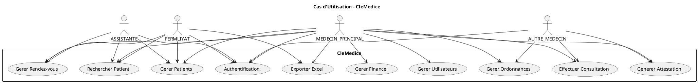
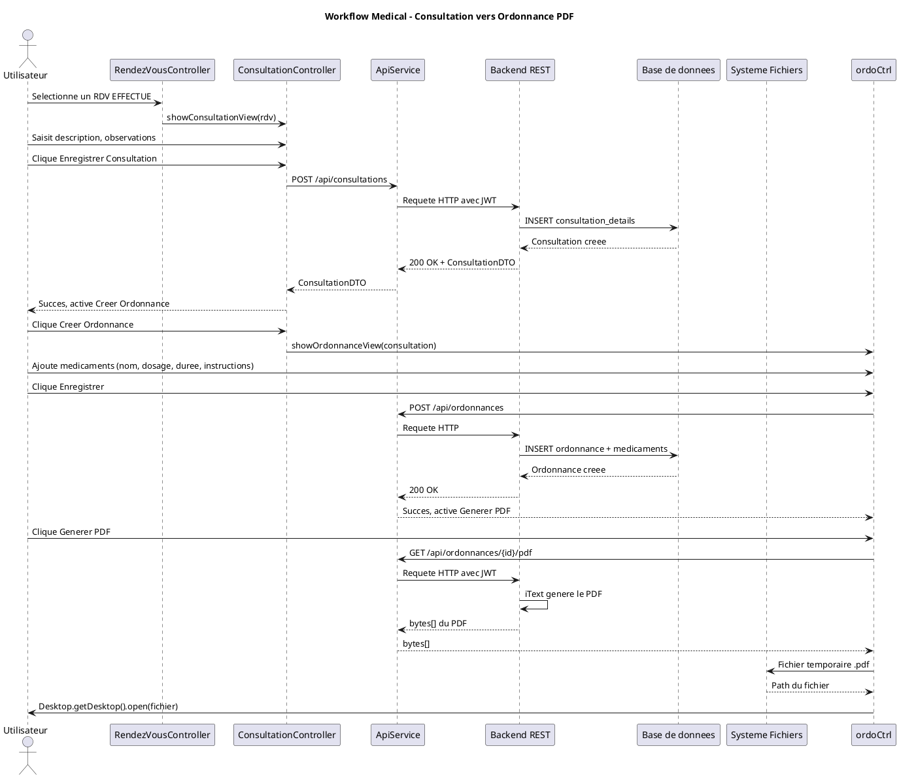
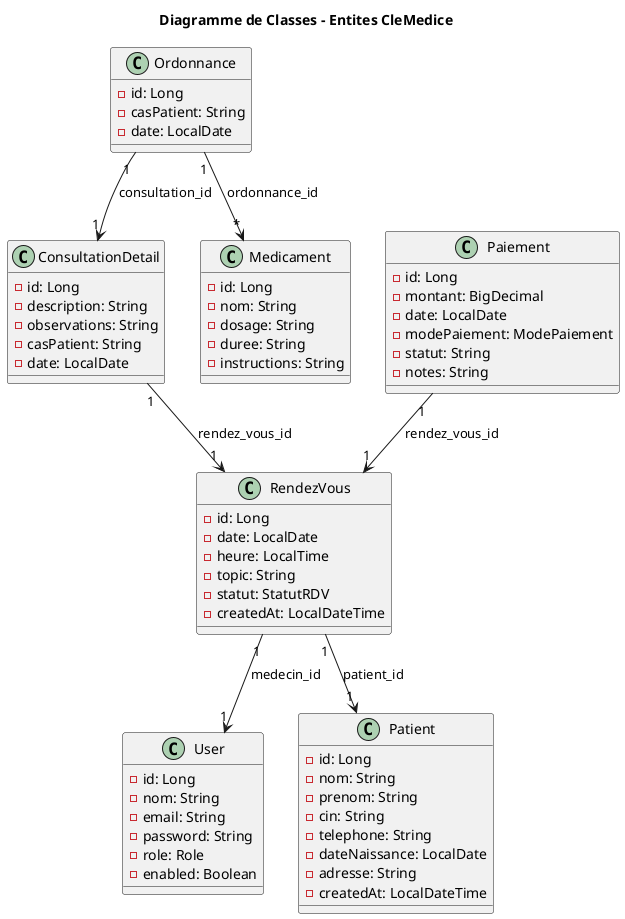
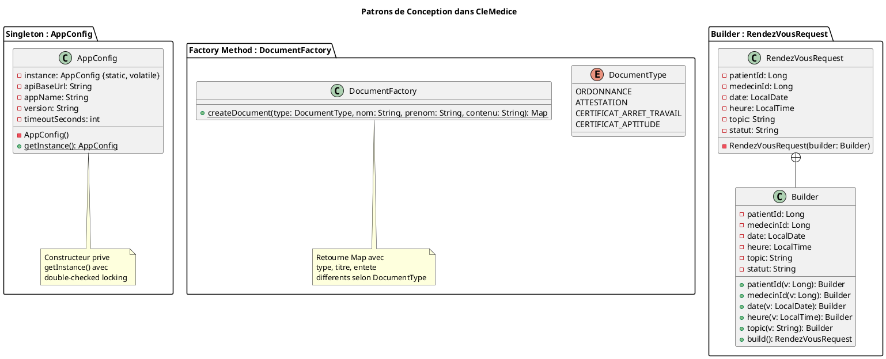

# Rapport de Génie Logiciel

## Projet CleMedice — Application de Gestion de Cabinet Médical

**Développé par :** Najim Badr Eddin & Adil Nouri  
**Framework :** JavaFX 21 + Spring Boot 3.2.5  
**Base de données :** H2 (développement) / MySQL (production)  
**Date :** Juin 2026

---

## Introduction

CleMedice est une application desktop de gestion de cabinet médical. Elle gère les patients (CRUD avec recherche par nom, prénom ou CIN), les rendez-vous (planification, annulation, filtrage par date avec badges de statut), les consultations (liées aux rendez-vous), les ordonnances (avec liste de médicaments et génération PDF), les attestations médicales (génération PDF), la comptabilité (tableau des paiements, totaux mensuels/annuels, export Excel) et les utilisateurs (CRUD avec rôles).

Quatre rôles utilisateur sont définis : MEDECIN_PRINCIPAL (accès complet), FERMLIYAT (patients, rendez-vous, exports), ASSISTANTE (consultation seule) et AUTRE_MEDECIN (consultations, ordonnances, attestations). L'authentification utilise des jetons JWT.

Ce rapport présente le cahier des charges de CleMedice, l'organisation Scrum en 4 sprints, les trois patrons de conception implémentés (Singleton, Factory Method, Builder), la suite de 18 tests (JUnit 5, Mockito, Spring Boot Test), et les diagrammes UML du système.

---

## Chapitre 1 — Cahier des charges de CleMedice

### 1.1 Contexte et objectif

CleMedice remplace la gestion papier d'un cabinet médical par une application informatisée complète. Le cabinet souhaitait centraliser la gestion des patients, rendez-vous, consultations, prescriptions et finances dans un seul outil accessible depuis un poste desktop. L'application est développée en JavaFX pour le poste client et Spring Boot pour le serveur REST.

### 1.2 Besoins fonctionnels

1. L'utilisateur s'authentifie via `POST /api/auth/login` avec email et mot de passe. Le backend retourne un JWT contenant l'ID, l'email et le rôle. Le token expire après 24h.
2. Le médecin peut ajouter, modifier, supprimer et rechercher des patients (nom, prénom, CIN, téléphone, date de naissance, adresse). La recherche utilise `GET /api/patients/search?keyword=`.
3. Le secrétariat peut planifier des rendez-vous avec sélection du patient, date, heure, motif. Chaque RDV affiche un badge coloré : vert pour PLANIFIE, bleu pour EFFECTUE, rouge pour ANNULE.
4. Le médecin peut annuler un RDV (statut passe à ANNULE) via `PUT /api/rendezvous/{id}/statut?statut=ANNULE`.
5. La consultation s'ouvre uniquement depuis l'écran RDV en sélectionnant un rendez-vous et en cliquant "Effectuer Consultation". Le bouton Consultation a été supprimé du tableau de bord.
6. L'ordonnance se crée uniquement après avoir sauvegardé une consultation. Le bouton "Créer Ordonnance" est désactivé tant que la consultation n'est pas enregistrée.
7. L'utilisateur ajoute des médicaments à l'ordonnance (nom, dosage, durée, instructions) et génère un PDF via `GET /api/ordonnances/{id}/pdf`. Le PDF s'ouvre dans le lecteur par défaut du système.
8. L'utilisateur génère une attestation médicale PDF via `POST /api/attestations/generate` avec sélection du patient et saisie du contenu.
9. Le MEDECIN_PRINCIPAL consulte le tableau des paiements avec totaux mensuel et annuel, ajoute des paiements et exporte les données en Excel via `GET /api/export/finance?start=&end=`.
10. Le MEDECIN_PRINCIPAL gère les utilisateurs (création, modification, suppression, réinitialisation du mot de passe) via les endpoints `GET/POST/PUT/DELETE /api/users`.

### 1.3 Besoins non-fonctionnels

| Besoin | Valeur / Contrainte |
|---|---|
| Sécurité | JWT Bearer sur tous les endpoints sauf `/api/auth/login`. Mots de passe stockés avec BCrypt. |
| Performance | Temps de réponse API inférieur à 2 secondes pour 95% des requêtes. |
| Portabilité | JavaFX 21 garantit le fonctionnement sur Windows, macOS et Linux. |
| Ergonomie | Feuille de style CSS globale (`styles.css`) appliquée à toutes les vues FXML. Badges colorés pour les statuts (vert/bleu/rouge). |
| Base de données | H2 fichier (`./data/clemedice`) en développement. MySQL pour la production. |

### 1.4 Workflow imposé par l'application

1. Le patient doit exister dans le système avant toute opération.
2. Un rendez-vous est créé pour ce patient.
3. La consultation est accessible UNIQUEMENT depuis un RDV sélectionné (bouton "Effectuer Consultation").
4. L'ordonnance est créée UNIQUEMENT après la sauvegarde de la consultation (bouton "Créer Ordonnance" désactivé avant).
5. Le paiement est enregistré pour le rendez-vous correspondant.

Les boutons "Consultations" et "Ordonnances" ont été **supprimés du tableau de bord** pour empêcher tout accès direct et forcer le respect de ce workflow.

### 1.5 Architecture technique

**Frontend :** JavaFX 21 avec FXML pour les vues, CSS global (`styles.css`) pour le design, `java.net.http.HttpClient` pour les appels REST, Jackson pour la désérialisation JSON, token JWT stocké statiquement dans `ApiService.java`.

**Backend :** Spring Boot 3.2.5, Spring Security avec JWT (jjwt 0.12.5), Spring Data JPA / Hibernate, iText Core 8.0.4 pour la génération PDF, Apache POI 5.2.5 pour l'export Excel.

**Contrôleurs frontend :** `LoginController`, `DashboardController`, `PatientsController`, `RendezVousController`, `ConsultationController`, `OrdonnanceController`, `AttestationController`, `FinanceController`, `UsersController`.

**Endpoints backend principaux :**

| Méthode | Endpoint | Rôle requis |
|---|---|---|
| POST | `/api/auth/login` | Aucun |
| GET | `/api/patients` | Tous |
| GET | `/api/patients/search?keyword=` | Tous |
| POST | `/api/patients` | MEDECIN_PRINCIPAL, FERMLIYAT |
| PUT | `/api/patients/{id}` | MEDECIN_PRINCIPAL, FERMLIYAT |
| DELETE | `/api/patients/{id}` | MEDECIN_PRINCIPAL |
| GET | `/api/rendezvous` | Tous |
| GET | `/api/rendezvous/date?date=` | Tous |
| POST | `/api/rendezvous` | Tous |
| PUT | `/api/rendezvous/{id}/statut?statut=` | Tous |
| GET | `/api/consultations/rendezvous/{rdvId}` | Tous |
| POST | `/api/consultations` | Tous |
| PUT | `/api/consultations/{id}` | Tous |
| POST | `/api/ordonnances` | Tous |
| GET | `/api/ordonnances/{id}/pdf` | Tous |
| POST | `/api/attestations/generate` | Tous |
| GET | `/api/finance` | MEDECIN_PRINCIPAL |
| POST | `/api/finance` | MEDECIN_PRINCIPAL |
| GET | `/api/finance/summary?annee=&mois=` | MEDECIN_PRINCIPAL |
| GET | `/api/export/finance?start=&end=` | MEDECIN_PRINCIPAL |
| GET/POST/PUT/DELETE | `/api/users[/{id}]` | MEDECIN_PRINCIPAL |

### 1.6 Modèle de données

7 tables composent la base de données :

- **`users`** : id, nom, email, password (BCrypt), role (enum MEDECIN_PRINCIPAL/FERMLIYAT/ASSISTANTE/AUTRE_MEDECIN), enabled (boolean).
- **`patients`** : id, nom, prenom, cin (unique), telephone, date_naissance, adresse, created_at.
- **`rendez_vous`** : id, patient_id (FK → patients), medecin_id (FK → users), date, heure, topic, statut (enum PLANIFIE/EFFECTUE/ANNULE), created_at.
- **`consultation_details`** : id, rendez_vous_id (FK → rendez_vous, OneToOne), description, observations, cas_patient, date.
- **`ordonnances`** : id, consultation_id (FK → consultation_details), cas_patient, date.
- **`medicaments`** : id, ordonnance_id (FK → ordonnances), nom, dosage, duree, instructions.
- **`paiements`** : id, rendez_vous_id (FK → rendez_vous, OneToOne), montant (BigDecimal), date, mode_paiement (enum ESPECES/CHEQUE/VIREMENT/CARTE_BANCAIRE), statut, notes.

---

## Chapitre 2 — Modèle de développement utilisé

### 2.1 Organisation en sprints

Le développement a suivi Scrum avec 4 sprints de 2 semaines chacun.

| Sprint | Semaines | Fonctionnalités développées | Livrable |
|---|---|---|---|
| 1 | 1-2 | Authentification JWT, CRUD patients, structure Spring Boot + JavaFX | Login + écran Patients fonctionnel |
| 2 | 3-4 | Rendez-vous avec filtrage par date, badges de statut (PLANIFIE/EFFECTUE/ANNULE) | Écran RDV complet avec navigation |
| 3 | 5-6 | Consultations liées aux RDV, ordonnances avec médicaments, génération PDF (iText) | Workflow Patient→RDV→Consultation→Ordonnance complet |
| 4 | 7-8 | Gestion financière (paiements, totaux, export Excel), attestations PDF, gestion utilisateurs, 18 tests | Application complète + tests |

### 2.2 Répartition des tâches (RACI simplifié)

| Composant | Najim | Adil | Mohsin | A (Approbateur) | I (Informé) |
|---|---|---|---|---|---|---|
| Authentification / Security / JWT | R | C |  | Najim |  |
| Structure JavaFX, navigation, CSS global | R | C | C | Najim |  |
| ApiService (client HTTP) | R | C |  | Najim |  |
| Patients (CRUD + recherche) | R | C |  | Najim |  |
| Rendez-vous (CRUD + filtrage) | R | C |  | Najim |  |
| Entités JPA / Repositories | C | R | C | Adil |  |
| Consultations | R | R |  | Najim |  |
| Ordonnances + PDF | C | R |  | Adil |  |
| Attestations PDF |  | R |  | Adil |  |
| Finance (paiements, totaux, export Excel) | C | R |  | Adil |  |
| Gestion utilisateurs | R | C |  | Najim |  |
| DataInitializer (seed) | R | C | C | Najim |  |
| Tests (JUnit, Mockito, Intégration) | R | R | R | Najim |  |

---

## Chapitre 3 — Design Patterns implémentés

### 3.1 Singleton — AppConfig

**Fichier :** `frontend/src/main/java/com/cabinet/ui/config/AppConfig.java`

```java
public class AppConfig {
    private static volatile AppConfig instance;
    
    private String apiBaseUrl = "http://localhost:8080/api";
    private String appName = "CleMedice";
    private String version = "1.0.0";
    private int timeoutSeconds = 10;
    
    private AppConfig() {}
    
    public static AppConfig getInstance() {
        if (instance == null) {
            synchronized (AppConfig.class) {
                if (instance == null) {
                    instance = new AppConfig();
                }
            }
        }
        return instance;
    }
    // getters et setters
}
```

Dans CleMedice, tous les contrôleurs JavaFX accèdent à la même URL de base de l'API (`http://localhost:8080/api`) via `AppConfig.getInstance().getApiBaseUrl()`. Le double-checked locking avec `volatile` garantit qu'un seul thread crée l'instance, même si plusieurs contrôleurs chargent simultanément.

### 3.2 Factory Method — DocumentFactory

**Fichier :** `backend/src/main/java/com/cabinet/factory/DocumentFactory.java`

```java
public enum DocumentType {
    ORDONNANCE, ATTESTATION, 
    CERTIFICAT_ARRET_TRAVAIL, CERTIFICAT_APTITUDE
}

public static Map<String, String> createDocument(
        DocumentType type, String patientNom, 
        String patientPrenom, String contenu) {
    // switch sur type, retourne une Map avec:
    // - type, titre, entete differents selon le type
    // - patientNom, patientPrenom, date, contenu communs
}
```

Quatre types de documents partagent la même structure (`patientNom`, `date`, `contenu`) mais diffèrent par `type`, `titre` et `entete`. Ordonnance produit "Ordonnance Médicale", Attestation produit "Attestation Médicale", etc. La factory centralise cette logique : ajouter un nouveau type revient à ajouter une valeur à l'enum et un `case` dans le `switch`.

### 3.3 Builder — RendezVousRequest

**Fichier :** `frontend/src/main/java/com/cabinet/ui/model/RendezVousRequest.java`

```java
public class RendezVousRequest {
    private final Long patientId;
    private final Long medecinId;
    private final LocalDate date;
    private final LocalTime heure;
    private final String topic;
    private final String statut;
    
    private RendezVousRequest(Builder b) { /* copie depuis builder */ }
    
    public static class Builder {
        private Long patientId, medecinId;
        private LocalDate date;
        private LocalTime heure;
        private String topic = "";
        private String statut = "PLANIFIE";
        
        public Builder patientId(Long v) { this.patientId = v; return this; }
        public Builder medecinId(Long v) { this.medecinId = v; return this; }
        public Builder date(LocalDate v) { this.date = v; return this; }
        public Builder heure(LocalTime v) { this.heure = v; return this; }
        public Builder topic(String v)  { this.topic = v; return this; }
        public RendezVousRequest build() {
            if (patientId == null) throw new IllegalStateException("patientId requis");
            if (medecinId == null) throw new IllegalStateException("medecinId requis");
            if (date == null)      throw new IllegalStateException("date requise");
            if (heure == null)     throw new IllegalStateException("heure requise");
            return new RendezVousRequest(this);
        }
    }
}
```

Utilisation typique dans le contrôleur RDV :

```java
RendezVousRequest req = new RendezVousRequest.Builder()
    .patientId(selectedPatientId)
    .medecinId(getLoggedInMedecinId())
    .date(datePicker.getValue())
    .heure(LocalTime.parse(timeField.getText()))
    .topic(topicField.getText())
    .build();
```

La création d'un RDV nécessite 6 champs dont 4 obligatoires. Le builder valide les champs manquants dans `build()` avant de créer l'objet. `statut` a une valeur par défaut "PLANIFIE".

### 3.4 Tableau récapitulatif

| Pattern | Classe | Package | Problème résolu dans CleMedice |
|---|---|---|---|
| Singleton | `AppConfig` | `com.cabinet.ui.config` | Configuration centralisée (URL API, timeout) accessible par tous les contrôleurs JavaFX |
| Factory Method | `DocumentFactory` | `com.cabinet.factory` | Création de 4 types de documents médicaux avec structure commune mais titres et en-têtes différents |
| Builder | `RendezVousRequest` | `com.cabinet.ui.model` | Construction d'une requête RDV avec 6 champs, validation des 4 champs obligatoires avant création |

---

## Chapitre 4 — Tests

### 4.1 PatientServiceTest — Tests unitaires (Mockito)

**Fichier :** `backend/src/test/java/com/cabinet/service/PatientServiceTest.java`

`PatientRepository` est annoté `@Mock`, `PatientService` est annoté `@InjectMocks`. Le service est testé sans base de données réelle.

| Méthode de test | Ce qui est testé | Résultat |
|---|---|---|
| `testGetAllPatients` | `patientRepository.findAll()` retourne une liste d'un patient. Vérifie `size=1` et `nom=Badr Eddin` | PASSED |
| `testGetPatientById` | `findById(1L)` retourne `Optional.of(samplePatient)`. Vérifie `prenom=Najim`, `cin=BK247891` | PASSED |
| `testGetPatientByIdNotFound` | `findById(99L)` retourne `Optional.empty()`. Vérifie `RuntimeException` avec message contenant "99" | PASSED |
| `testCreatePatient` | `save(any(Patient.class))` retourne `samplePatient`. Vérifie `verify(save, times(1))` | PASSED |
| `testDeletePatient` | `deleteById(1L)` ne fait rien. Vérifie `assertDoesNotThrow` | PASSED |
| `testSearchPatients` | `search("Najim")` retourne une liste. Vérifie `prenom=Najim` | PASSED |

### 4.2 DocumentFactoryTest — Tests unitaires

**Fichier :** `backend/src/test/java/com/cabinet/factory/DocumentFactoryTest.java`

| Méthode de test | Ce qui est vérifié | Résultat |
|---|---|---|
| `testCreateOrdonnance` | `type=ORDONNANCE`, `titre=Ordonnance Médicale`, `entete` contient "Akbib" | PASSED |
| `testCreateAttestation` | `type=ATTESTATION`, `titre=Attestation Médicale`, `entete` contient "Bazza" et "Houssam" | PASSED |
| `testCreateArretTravail` | `type=ARRET_TRAVAIL`, `titre=Certificat d'Arrêt de Travail` | PASSED |
| `testCreateCertificatAptitude` | `type=APTITUDE`, `titre=Certificat d'Aptitude`, `entete` contient "Naciri" | PASSED |
| `testDocumentAlwaysHasDate` | Pour chaque `DocumentType`, `doc.get("date")` n'est ni null ni vide | PASSED |

### 4.3 PatientControllerIntegrationTest — Tests d'intégration

**Fichier :** `backend/src/test/java/com/cabinet/controller/PatientControllerIntegrationTest.java`

Annotations : `@SpringBootTest`, `@AutoConfigureMockMvc`, `@ActiveProfiles("test")`. Base H2 en mémoire configurée dans `application-test.properties`. Un token JWT est extrait via `getAdminToken()` qui parse la réponse de `POST /api/auth/login`.

| Méthode de test | Endpoint testé | Code HTTP attendu | Vérification supplémentaire | Résultat |
|---|---|---|---|---|
| `testGetAllPatientsAuthenticated` | `GET /api/patients` avec JWT | 200 | `contentType` JSON | PASSED |
| `testGetAllPatientsUnauthenticated` | `GET /api/patients` sans token | 403 | | PASSED |
| `testCreatePatient` | `POST /api/patients` avec JSON | 200 | `jsonPath("$.nom")=TestNom`, `$.cin=TEST00001` | PASSED |
| `testSearchPatients` | `GET /api/patients/search?keyword=Najim` avec JWT | 200 | `contentType` JSON | PASSED |
| `testLoginWrongPassword` | `POST /api/auth/login` mauvais mot de passe | 401 | | PASSED |

### 4.4 Résultats globaux

| Classe de test | Nombre de tests | Type | Statut |
|---|---|---|---|
| `PatientServiceTest` | 6 | Unitaire (Mockito) | PASSED |
| `DocumentFactoryTest` | 5 | Unitaire | PASSED |
| `SingletonPatternTest` | 2 | Unitaire | PASSED |
| `PatientControllerIntegrationTest` | 5 | Intégration (Spring Boot) | PASSED |
| **TOTAL** | **18** | | **BUILD SUCCESS** |

**Commande d'exécution :** `mvn test` (dans le dossier `backend/`)

**Dernières lignes dans la console :**
```
[INFO] Tests run: 18, Failures: 0, Errors: 0, Skipped: 0
[INFO] ------------------------------------------------------------------------
[INFO] BUILD SUCCESS
[INFO] ------------------------------------------------------------------------
```

---

## Chapitre 5 — Diagrammes UML

### 5.1 Diagramme de cas d'utilisation — CleMedice



### 5.2 Diagramme de séquence — Workflow médical principal



### 5.3 Diagramme de classes — Entités principales



### 5.4 Diagramme de classes — Design Patterns



---

## Conclusion

CleMedice est une application complète de gestion de cabinet médical avec 10 écrans, 4 rôles utilisateur, 3 patrons de conception (Singleton, Factory Method, Builder), 18 tests (18/18 PASSED, BUILD SUCCESS) et un workflow imposé Patient→RDV→Consultation→Ordonnance→Paiement. Le projet couvre l'authentification JWT, le CRUD complet des patients, rendez-vous, consultations, ordonnances, paiements et utilisateurs, la génération PDF/Excel, et l'initialisation automatique de la base de données avec 20 patients, 5 utilisateurs, 10 RDV et 4 paiements.

Les évolutions futures incluent la migration vers MySQL pour la production, le déploiement via Docker, et une application mobile permettant aux patients de consulter leurs rendez-vous et ordonnances en ligne.
