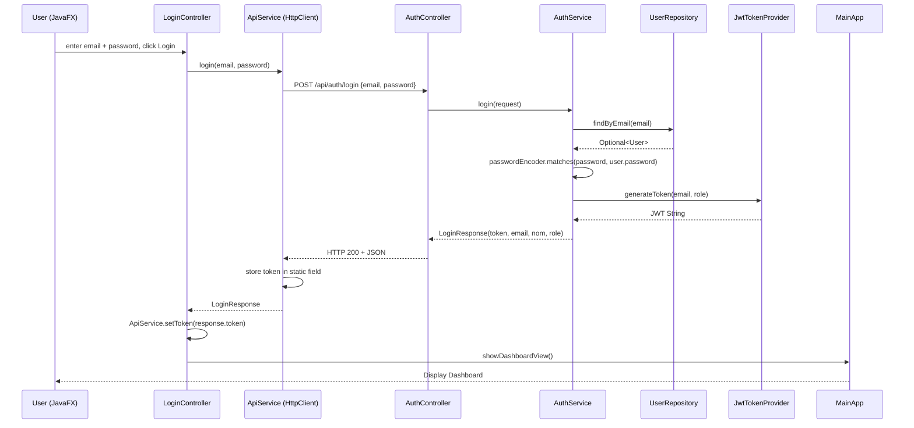
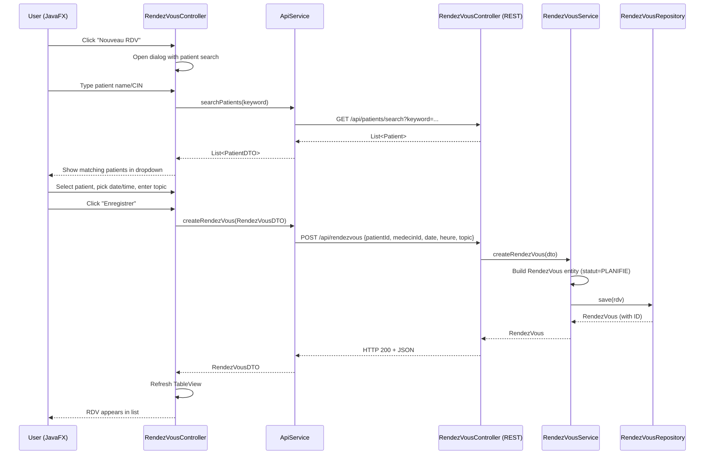
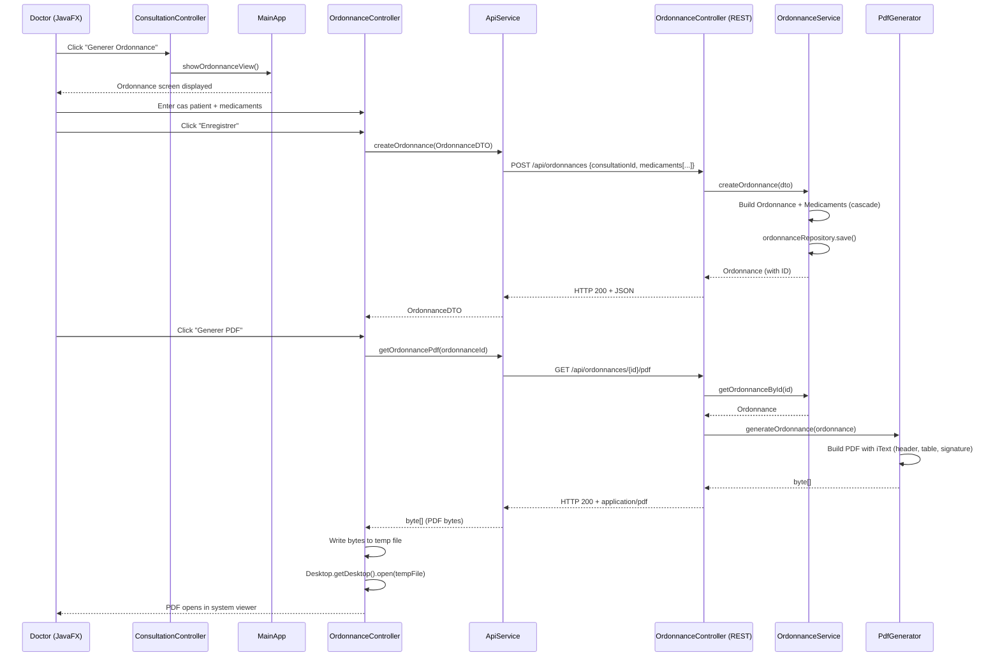

# Technical Conception Document — CleMedice

## Medical Cabinet Management System (JavaFX + Spring Boot)

| Document Owner | Najim & Adil |
|---|---|
| Version | 1.0 |
| Date | 2026-05-20 |
| Status | Draft |

---

## 1. PROJECT OVERVIEW & SCOPE

### 1.1 Description

**CleMedice** is a desktop application for managing a medical cabinet, built with a **Spring Boot REST API** backend and a **JavaFX** thick client. Communication between the two tiers uses **HTTP/JSON** with **JWT bearer authentication**. The database is **H2** (dev) / **MySQL** (production) with **JPA/Hibernate** for ORM.

### 1.2 Technology Stack

| Layer | Technology |
|---|---|
| Backend Framework | Spring Boot 3.2.5 |
| Language | Java 21+ |
| Security | Spring Security + JWT (jjwt 0.12) |
| ORM | Spring Data JPA / Hibernate |
| Database | H2 (dev) / MySQL (prod) |
| PDF Generation | iText 8 |
| Excel Export | Apache POI 5 |
| Frontend | JavaFX 21 (FXML + Controllers) |
| HTTP Client | Java 11+ `java.net.http.HttpClient` |
| JSON | Jackson (auto-configured) |
| Build Tool | Maven |

### 1.3 Scope of Work

| Module | Description |
|---|---|
| **User & Permission Management** | 4 roles: Médecin Principal, Fermlyat, Assistante, Autre Médecin. JWT token carries role. Endpoints guarded by `@PreAuthorize` / request-matcher rules. |
| **Patient Management** | CRUD with CIN (unique), nom, prénom, téléphone, date naissance, adresse. Search by CIN or name. |
| **Appointment Management** | Calendar-based Rendez-vous linked to Patient + User (medecin). Status lifecycle: PLANIFIE → EFFECTUE / ANNULE. |
| **Consultation & Follow-up** | Detailed consultation notes, observations, cas patient. One-to-one with RendezVous. |
| **Medical Documents** | Ordonnance (with medicament lines) and Attestation Médicale generated as PDF (iText). Stored as byte[] or regenerated on demand. |
| **Financial Tracking** | Paiement linked to RendezVous. Dashboard with monthly/annual totals (Dakhal d Flous). Role-restricted to Médecin Principal. |
| **Excel Export** | Export patients, rendez-vous, or filtered finance data via Apache POI. |

### 1.4 Architecture Overview

```
┌─────────────────────────────────────────────────────┐
│                    JavaFX Client                     │
│  ┌──────────┐  ┌────────────┐  ┌──────────────────┐ │
│  │ FXML View │  │ Controller │  │ ApiService       │ │
│  │ (Screen)  │──│ (Java)     │──│ (HttpClient)     │ │
│  └──────────┘  └────────────┘  └────────┬─────────┘ │
└──────────────────────────────────────────┼───────────┘
                                           │ HTTP + JWT
                                           │ (JSON)
┌──────────────────────────────────────────┼───────────┐
│              Spring Boot Backend          │           │
│  ┌───────────┐  ┌──────────┐  ┌──────────▼────────┐ │
│  │ Controller│─▶│ Service  │─▶│ Repository (JPA)  │ │
│  └───────────┘  └──────────┘  └──────────┬─────────┘ │
│  ┌───────────┐  ┌──────────┐             │          │
│  │ JWT Filter│  │ PDF/Excel│             ▼          │
│  │ (Security)│  │ Generator│          ┌──────┐      │
│  └───────────┘  └──────────┘          │  DB  │      │
│                                        └──────┘      │
└─────────────────────────────────────────────────────┘
```

---

## 2. TEAM ROLES & RESPONSIBILITIES (RACI MATRIX)

### 2.1 Legend

| R | Responsible (does the work) |
|---|---|
| A | Accountable (approves, signs off) |
| C | Consulted (provides input) |
| I | Informed (kept up to date) |

### 2.2 RACI Matrix

| Component / Task | Najim | Adil |
|---|---|---|
| **Backend Architecture** | | |
| Spring Boot project setup (POM, properties) | **R/A** | I |
| Package structure & configuration | **R/A** | I |
| Global exception handler, CORS | **R/A** | I |
| **Spring Security + JWT** | | |
| JwtTokenProvider (generate/validate) | **R/A** | C |
| JwtAuthenticationFilter | **R/A** | C |
| SecurityConfig (endpoint rules) | **R** | **A** |
| DataInitializer (admin seed) | **R/A** | I |
| **Database & JPA Entities** | | |
| Entity classes (User, Patient, RendezVous, ConsultationDetail, Ordonnance, Medicament, Paiement) | C | **R/A** |
| Enums (Role, StatutRDV, ModePaiement) | I | **R/A** |
| Repository interfaces (JPA queries) | C | **R/A** |
| **REST Controllers** | | |
| AuthController (/api/auth) | **R/A** | I |
| PatientController (/api/patients) | **R** | **A** |
| RendezVousController (/api/rendezvous) | **R** | **A** |
| ConsultationController (/api/consultations) | **R/A** | C |
| OrdonnanceController (/api/ordonnances) | C | **R/A** |
| PaiementController (/api/finance) | I | **R/A** |
| UserController (/api/users) | **R/A** | I |
| ExportController (/api/export) | I | **R/A** |
| **Service Layer** | | |
| AuthService | **R/A** | I |
| PatientService, RendezVousService | **R** | **A** |
| ConsultationService | **R/A** | C |
| OrdonnanceService | C | **R/A** |
| PaiementService | I | **R/A** |
| UserService | **R/A** | I |
| **JavaFX Frontend** | | |
| MainApp (navigation, scene switching) | **R/A** | I |
| LoginView + LoginController | **R/A** | C |
| DashboardView + DashboardController | **R/A** | C |
| PatientsView + PatientsController | **R/A** | C |
| RendezVousView + RendezVousController | **R/A** | C |
| ConsultationView + ConsultationController | **R/A** | C |
| OrdonnanceView + OrdonnanceController | **R** | **A** |
| AttestationView + AttestationController | **R** | **A** |
| FinanceView + FinanceController | I | **R/A** |
| UsersView + UsersController | **R/A** | I |
| ApiService (HTTP client layer) | **R/A** | C |
| FXML layout files + CSS | **R/A** | C |
| **Document Generation** | | |
| PdfGenerator (iText: ordonnance + attestation) | C | **R/A** |
| **Excel Export** | | |
| ExcelExporter (Apache POI: patients, RDV, finance) | I | **R/A** |
| **Finance Module** | | |
| Paiement dashboard (monthly/annual totals) | I | **R/A** |
| Filter by period, medecin | I | **R/A** |

---

## 3. UML USE CASE SPECIFICATIONS

### 3.1 Actors

| Actor | Description |
|---|---|
| **Visiteur** | Unauthenticated user. Can only access the Login screen. |
| **Médecin Principal** | Full access: patients, RDV, consultations, ordonnances, attestations, finance, user management. |
| **Fermlyat** | Can manage patients and RDV, export data. Cannot see finance or manage users. |
| **Assistante** | Read-only access to patients and RDV. Can mark RDV as effectué. |
| **Autre Médecin** | Can create consultations, ordonnances, attestations for their assigned patients. Cannot see finance. |

### 3.2 Use Case 1: User Login (JWT Authentication)

**Primary Actor:** Visiteur  
**Pre-condition:** The system is running, Login screen is displayed.  
**Post-condition (success):** User receives a JWT token and is redirected to the Dashboard.  
**Post-condition (failure):** Error message is shown, user remains on Login screen.

**Nominal Scenario:**

| Step | Actor | System |
|---|---|---|
| 1 | Enters email and password in LoginView.fxml | |
| 2 | Clicks "Se connecter" | |
| 3 | | LoginController calls `ApiService.login(email, password)` which sends `POST /api/auth/login` with JSON `{email, password}`. |
| 4 | | AuthController receives request, calls `AuthService.login()`. |
| 5 | | AuthService loads User from `UserRepository.findByEmail()`. |
| 6 | | `PasswordEncoder.matches()` verifies password. |
| 7 | | `JwtTokenProvider.generateToken(email, role)` creates JWT. |
| 8 | | Returns `LoginResponse {token, email, nom, role}`. |
| 9 | | ApiService stores token, deserializes response. |
| 10 | | `MainApp.showDashboardView()` loads Dashboard screen. |

**Alternative Scenario — Invalid Credentials:**

| Step | Actor | System |
|---|---|---|
| 3a | | Backend throws `BadCredentialsException`. |
| 4a | | GlobalExceptionHandler returns `401` with error message. |
| 5a | | ApiService throws `RuntimeException("Login failed: ...")`. |
| 6a | | LoginController catches exception, shows red error label. |

### 3.3 Use Case 2: Create Rendez-vous (with Patient CIN Lookup)

**Primary Actor:** Fermlyat, Médecin Principal, Assistante  
**Pre-condition:** User is authenticated, Rendez-vous screen is displayed. Patient already exists in database.  
**Post-condition:** Rendez-vous is saved with status PLANIFIE, calendar view refreshes.

**Nominal Scenario:**

| Step | Actor | System |
|---|---|---|
| 1 | Clicks "Nouveau RDV" button. | |
| 2 | | RendezVousController opens modal dialog with patient search field. |
| 3 | Starts typing patient name or CIN. | |
| 4 | | Patient search fires `GET /api/patients/search?keyword=...`. |
| 5 | | PatientController returns matching patients. |
| 6 | Selects patient from dropdown. | |
| 7 | Picks date, time, topic, medecin. Clicks "Enregistrer". | |
| 8 | | RendezVousController sends `POST /api/rendezvous` with JSON `{patientId, medecinId, date, heure, topic}`. |
| 9 | | RendezVousService creates RendezVous entity, sets statut=PLANIFIE. |
| 10 | | `RendezVousRepository.save(rdv)`. |
| 11 | | Returns saved RendezVous with generated ID. |
| 12 | | TableView refreshes, new RDV appears in calendar. |

**Alternative Scenario — Patient Does Not Exist:**

| Step | Actor | System |
|---|---|---|
| 3a | Searches for patient, no results. | |
| 4a | Clicks "Nouveau Patient" from within dialog. | |
| 5a | | Opens patient creation form (name, CIN, tel, etc.). |
| 6a | Fills form, saves. | |
| 7a | | `POST /api/patients` creates patient, returns new Patient with ID. |
| 8a | Dialog auto-selects newly created patient. | Continues from step 7 of nominal flow. |

### 3.4 Use Case 3: Generate Ordonnance (Prescription PDF)

**Primary Actor:** Médecin Principal, Autre Médecin  
**Pre-condition:** A consultation has been created for a RendezVous. The Ordonnance screen is open with consultation context.  
**Post-condition:** Ordonnance is persisted, PDF is generated and opened in system PDF viewer.

**Nominal Scenario:**

| Step | Actor | System |
|---|---|---|
| 1 | Consultation screen is shown for a specific RDV. Doctor clicks "Generer Ordonnance". | |
| 2 | | `MainApp.showOrdonnanceView()` opens Ordonnance screen. |
| 3 | Doctor fills: Cas Patient, adds medicaments (nom, dosage, duree, instructions). | |
| 4 | Clicks "Enregistrer Ordonnance". | |
| 5 | | OrdonnanceController sends `POST /api/ordonnances`. |
| 6 | | OrdonnanceService saves Ordonnance + Medicaments (cascade). |
| 7 | Backend returns saved Ordonnance with ID. | |
| 8 | Clicks "Generer PDF". | |
| 9 | | OrdonnanceController calls `GET /api/ordonnances/{id}/pdf`. |
| 10 | | PdfGenerator.generateOrdonnance() builds PDF with iText (header, patient info, medicament table, signature line). |
| 11 | | Returns `byte[]` with `Content-Disposition: attachment`. |
| 12 | | JavaFX receives bytes, saves to temp file, opens with `Desktop.getDesktop().open(file)` or `HostServices.showDocument()`. |

**Alternative Scenario — PDF Generation Failure:**

| Step | Actor | System |
|---|---|---|
| 10a | | PdfGenerator throws `RuntimeException("Failed to generate PDF")`. |
| 11a | | Controller returns HTTP 500. |
| 12a | | JavaFX shows Alert: "Erreur de generation PDF". |

---

## 4. CLASS DIAGRAM DESIGN (ARCHITECTURE)

### 4.1 Entity / Model Classes

```
┌─────────────────────────────────────────────────────────────────────────────┐
│                                 USER                                        │
├─────────────────────────────────────────────────────────────────────────────┤
│ - id: Long                                                                  │
│ - nom: String                                                               │
│ - email: String (unique)                                                    │
│ - password: String (BCrypt hashed)                                          │
│ - role: Role enum {MEDECIN_PRINCIPAL, FERMLIYAT, ASSISTANTE, AUTRE_MEDECIN} │
│ - enabled: boolean                                                          │
└──────────────────────┬──────────────────────────────────────────────────────┘
                       │ 1
                       │ has many
                       │ *
┌──────────────────────▼──────────────────────────────────────────────────────┐
│                             RENDEZVOUS                                      │
├─────────────────────────────────────────────────────────────────────────────┤
│ - id: Long                                                                  │
│ - patient: Patient @ManyToOne                                               │
│ - medecin: User @ManyToOne                                                  │
│ - date: LocalDate                                                           │
│ - heure: LocalTime                                                          │
│ - topic: String                                                             │
│ - statut: StatutRDV enum {PLANIFIE, EFFECTUE, ANNULE}                       │
│ - createdAt: LocalDateTime                                                  │
└──────┬────────────────────────────┬─────────────────────────────────────────┘
       │ 1                          │ 1
       │ has one                    │ has one (optional)
       │ 1                          │ 1
┌──────▼────────────────────┐ ┌────▼──────────────────────────────────┐
│   CONSULTATION_DETAIL     │ │            PAIEMENT                    │
├───────────────────────────┤ ├────────────────────────────────────────┤
│ - id: Long                │ │ - id: Long                             │
│ - rendezVous: RendezVous  │ │ - rendezVous: RendezVous @OneToOne    │
│   @OneToOne               │ │ - montant: Double                      │
│ - description: TEXT       │ │ - date: LocalDate                      │
│ - observations: TEXT      │ │ - modePaiement: ModePaiement enum      │
│ - casPatient: String      │ │ - statut: String                       │
│ - date: LocalDate         │ │ - notes: String                        │
│ - createdAt: LocalDateTime│ │ - createdAt: LocalDateTime             │
└────────┬──────────────────┘ └────────────────────────────────────────┘
         │ 1
         │ has many
         │ *
┌────────▼──────────────────┐
│        ORDONNANCE          │
├────────────────────────────┤
│ - id: Long                 │
│ - consultation:            │
│   ConsultationDetail       │
│   @ManyToOne               │
│ - casPatient: String       │
│ - date: LocalDate          │
│ - createdAt: LocalDateTime │
└────────┬───────────────────┘
         │ 1
         │ contains
         │ *
┌────────▼───────────────────┐
│       MEDICAMENT            │
├─────────────────────────────┤
│ - id: Long                  │
│ - ordonnance: Ordonnance    │
│   @ManyToOne                │
│ - nom: String               │
│ - dosage: String            │
│ - duree: String             │
│ - instructions: String      │
└─────────────────────────────┘

┌──────────────────────────────────────────┐
│              PATIENT                      │
├──────────────────────────────────────────┤
│ - id: Long                               │
│ - nom: String                            │
│ - prenom: String                         │
│ - cin: String (unique)                   │
│ - telephone: String                      │
│ - dateNaissance: LocalDate               │
│ - adresse: String                        │
│ - createdAt: LocalDateTime               │
└──────────────────────────────────────────┘
```

### 4.2 Repository Interfaces

```java
// UserRepository
interface UserRepository extends JpaRepository<User, Long> {
    Optional<User> findByEmail(String email);
    boolean existsByEmail(String email);
}

// PatientRepository
interface PatientRepository extends JpaRepository<Patient, Long> {
    Optional<Patient> findByCin(String cin);
    List<Patient> findByNomContainingIgnoreCase(String nom);
    @Query("SELECT p FROM Patient p WHERE ... LIKE %:keyword%")
    List<Patient> search(String keyword);
}

// RendezVousRepository
interface RendezVousRepository extends JpaRepository<RendezVous, Long> {
    List<RendezVous> findByDateOrderByHeure(LocalDate date);
    List<RendezVous> findByPatientId(Long patientId);
    List<RendezVous> findByDateBetweenOrderByDateAscHeureAsc(LocalDate start, LocalDate end);
    long countByDate(LocalDate date);
}

// ConsultationDetailRepository
interface ConsultationDetailRepository extends JpaRepository<ConsultationDetail, Long> {
    Optional<ConsultationDetail> findByRendezVousId(Long rendezVousId);
}

// OrdonnanceRepository
interface OrdonnanceRepository extends JpaRepository<Ordonnance, Long> {
    List<Ordonnance> findByConsultationId(Long consultationId);
}

// MedicamentRepository
interface MedicamentRepository extends JpaRepository<Medicament, Long> {
    List<Medicament> findByOrdonnanceId(Long ordonnanceId);
}

// PaiementRepository
interface PaiementRepository extends JpaRepository<Paiement, Long> {
    Optional<Paiement> findByRendezVousId(Long rendezVousId);
    @Query("SELECT COALESCE(SUM(p.montant), 0) FROM Paiement p WHERE p.date BETWEEN :start AND :end")
    Double sumByDateBetween(@Param("start") LocalDate start, @Param("end") LocalDate end);
    List<Paiement> findPaiementWithRendezVousBetween(LocalDate start, LocalDate end);
    @Query("SELECT FUNCTION('MONTH', p.date), SUM(p.montant) FROM Paiement p WHERE YEAR(p.date)=:annee GROUP BY MONTH(p.date)")
    List<Object[]> monthlyTotalsForYear(@Param("annee") int annee);
}
```

### 4.3 Service Layer

```
AuthService
├── login(LoginRequest) → LoginResponse

PatientService
├── getAllPatients() → List<Patient>
├── getPatientById(Long) → Patient
├── createPatient(PatientDTO) → Patient
├── updatePatient(Long, PatientDTO) → Patient
├── deletePatient(Long) → void
└── searchPatients(String) → List<Patient>

RendezVousService
├── getAllRendezVous() → List<RendezVous>
├── getRendezVousById(Long) → RendezVous
├── createRendezVous(RendezVousDTO) → RendezVous
├── updateStatut(Long, String) → RendezVous
├── getRendezVousByDate(LocalDate) → List<RendezVous>
├── getRendezVousBetweenDates(LocalDate, LocalDate) → List<RendezVous>
└── deleteRendezVous(Long) → void

ConsultationService
├── getAllConsultations() → List<ConsultationDetail>
├── getConsultationById(Long) → ConsultationDetail
├── getConsultationByRendezVous(Long) → ConsultationDetail
├── createConsultation(ConsultationDTO) → ConsultationDetail
└── updateConsultation(Long, ConsultationDTO) → ConsultationDetail

OrdonnanceService
├── getAllOrdonnances() → List<Ordonnance>
├── getOrdonnanceById(Long) → Ordonnance
├── createOrdonnance(OrdonnanceDTO) → Ordonnance
└── deleteOrdonnance(Long) → void

PaiementService
├── getAllPaiements() → List<Paiement>
├── getPaiementById(Long) → Paiement
├── createPaiement(PaiementDTO) → Paiement
├── getFinanceSummary(int annee, int mois) → FinanceSummaryDTO
├── getPaiementsBetweenDates(LocalDate, LocalDate) → List<Paiement>
└── deletePaiement(Long) → void

UserService
├── getAllUsers() → List<User>
├── createUser(UserDTO, String password) → User
├── updateUser(Long, UserDTO) → User
├── resetPassword(Long, String) → void
└── deleteUser(Long) → void
```

### 4.4 REST Controllers & Endpoint Mappings

| HTTP | Endpoint | Controller | Security |
|---|---|---|---|
| POST | `/api/auth/login` | AuthController | PUBLIC |
| GET | `/api/patients` | PatientController | MEDECIN_PRINCIPAL, FERMLIYAT, ASSISTANTE, AUTRE_MEDECIN |
| GET | `/api/patients/{id}` | PatientController | same |
| GET | `/api/patients/search?keyword=` | PatientController | same |
| POST | `/api/patients` | PatientController | MEDECIN_PRINCIPAL, FERMLIYAT |
| PUT | `/api/patients/{id}` | PatientController | MEDECIN_PRINCIPAL, FERMLIYAT |
| DELETE | `/api/patients/{id}` | PatientController | MEDECIN_PRINCIPAL |
| GET | `/api/rendezvous` | RendezVousController | All authenticated |
| POST | `/api/rendezvous` | RendezVousController | MEDECIN_PRINCIPAL, FERMLIYAT, ASSISTANTE |
| PUT | `/api/rendezvous/{id}/statut` | RendezVousController | All authenticated |
| GET | `/api/consultations` | ConsultationController | All authenticated |
| POST | `/api/consultations` | ConsultationController | MEDECIN_PRINCIPAL, AUTRE_MEDECIN |
| GET | `/api/ordonnances` | OrdonnanceController | All authenticated |
| POST | `/api/ordonnances` | OrdonnanceController | MEDECIN_PRINCIPAL, AUTRE_MEDECIN |
| GET | `/api/ordonnances/{id}/pdf` | OrdonnanceController | All authenticated |
| POST | `/api/attestations/generate` | AttestationController | MEDECIN_PRINCIPAL, AUTRE_MEDECIN |
| GET | `/api/finance` | PaiementController | MEDECIN_PRINCIPAL |
| GET | `/api/finance/summary` | PaiementController | MEDECIN_PRINCIPAL |
| POST | `/api/finance` | PaiementController | MEDECIN_PRINCIPAL |
| GET | `/api/users` | UserController | MEDECIN_PRINCIPAL |
| POST | `/api/users` | UserController | MEDECIN_PRINCIPAL |
| GET | `/api/export/patients` | ExportController | MEDECIN_PRINCIPAL, FERMLIYAT |
| GET | `/api/export/rendezvous` | ExportController | MEDECIN_PRINCIPAL, FERMLIYAT |
| GET | `/api/export/finance` | ExportController | MEDECIN_PRINCIPAL |

---

## 5. SEQUENCE DIAGRAMS (MERMAID.JS)

### 5.1 Authentication Workflow



### 5.2 Create Rendez-vous Workflow



### 5.3 Generate Ordonnance Workflow



---

## 6. COMPONENT WORK SPLIT & TIMELINE

### 6.1 Git Branching Strategy

```
main
  └── develop
        ├── feature/najim-auth       → Najim: Spring Security + JWT + Login
        ├── feature/najim-ui         → Najim: JavaFX screens (Patient, RDV, Consultation)
        ├── feature/adil-db          → Adil: Entities + Repositories + Services
        ├── feature/adil-finance     → Adil: Finance + PDF + Excel
        └── feature/adil-ordonnance  → Adil: Ordonnance + Attestation PDF
```

### 6.2 14-Day Sprint Plan (Parallel Tracks)

| Day | Najim (Backend + JavaFX UI) | Adil (DB + Finance + Documents) |
|---|---|---|
| **1** | Init backend Maven project, package structure, `application.properties` (H2), `CleMediceApplication.java`. | Init frontend Maven project, `pom.xml` with JavaFX 21 + Jackson, `MainApp.java` with scene navigation stubs. |
| **2** | `User` entity, `Role` enum, `UserRepository`, `DataInitializer`. `JwtTokenProvider`, `JwtAuthenticationFilter`, `SecurityConfig`. | `Patient`, `RendezVous` entities + repos. `PatientRepository.search()` query. |
| **3** | `AuthService`, `AuthController` (`POST /api/auth/login`). `LoginView.fxml` + `LoginController`. | `ConsultationDetail`, `Ordonnance`, `Medicament`, `Paiement` entities + repos + enums. |
| **4** | `PatientService`, `PatientController`. `PatientsView.fxml` + `PatientsController` (CRUD, search). | `RendezVousService`, `RendezVousController`. Finance queries in `PaiementRepository` (monthly/yearly sums). |
| **5** | `RendezVousService`, `RendezVousController`. `RendezVousView.fxml` + `RendezVousController` (date filter, CRUD). | `OrdonnanceService`, `OrdonnanceController`, `ConsultationService`, `ConsultationController`. |
| **6** | `ConsultationView.fxml` + `ConsultationController`. `DashboardView.fxml` + `DashboardController` (role-based button visibility). | `PdfGenerator` (iText: ordonnance + attestation). `OrdonnanceView.fxml` + `OrdonnanceController`. |
| **7** | `ApiService` HTTP client (login, patients, RDV, consultations). Connect all JavaFX screens to API. | `PaiementService`, `PaiementController`. `FinanceView.fxml` + `FinanceController` (summary cards + table). |
| **8** | `UserService`, `UserController`. `UsersView.fxml` + `UsersController`. User CRUD + reset password. | `AttestationView.fxml` + `AttestationController`. `AttestationController` (POST generate PDF). |
| **9** | Finish JavaFX: navigation fixes, error handling, loading states, disabled buttons per role. | `ExcelExporter` (Apache POI: patients, RDV, finance). `ExportController` endpoint wiring. |
| **10** | Test: full login → dashboard → patients → RDV → consultation flow. Fix issues. | Test: consultation → ordonnance → PDF. Finance summary + period filter. Excel downloads. |
| **11** | Integration test: JavaFX ↔ Backend end-to-end. JWT expiration handling. | Integration test: PDF generation with real iText. Excel file opening on Windows. |
| **12** | Bug fixes, `GlobalExceptionHandler` polish, CORS config hardening. | Bug fixes, `@PrePersist` audit fields, validation annotations on DTOs. |
| **13** | Code review (review Adil's PRs), merge `feature/adil-*` → `develop`. | Code review (review Najim's PRs), merge `feature/najim-*` → `develop`. |
| **14** | Final `develop` → `main` merge. Demo preparation. Generate final JAR + run scripts. | Documentation: `TECHNICAL_CONCEPTION.md`, README, setup guide. |

### 6.3 Merge & Integration Points

| Day | Event | Action |
|---|---|---|
| 4 | Adil's entity PR merged into `develop` | Najim rebases `feature/najim-auth` to use the actual entity classes |
| 7 | Najim's API PR merged | Adil rebases `feature/adil-finance` to call API endpoints from JavaFX |
| 10 | All feature branches merged | Full integration test |
| 14 | `develop` → `main` | Release candidate |

---

*Document generated for the CleMedice project — Najim & Adil, May 2026.*
